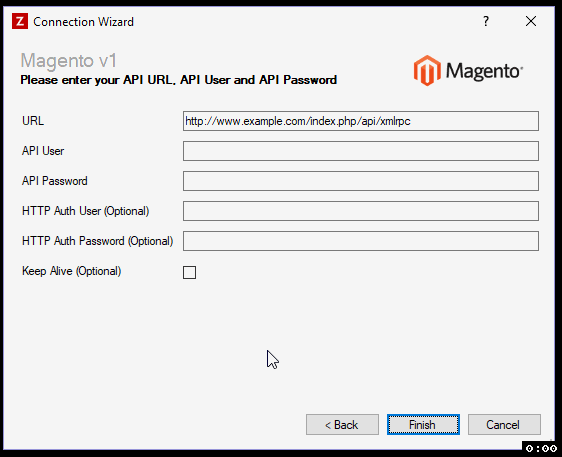

## 403: Forbidden response

If you receive a 403 Forbidden response from the website:

 * (In Magento) Check the Magento user's role, to ensure that the relevant area in Magento is enabled
 * (In Zynk) Check the **Keep Alive** flag on the Magento Connection, then uncheck the option again
 

